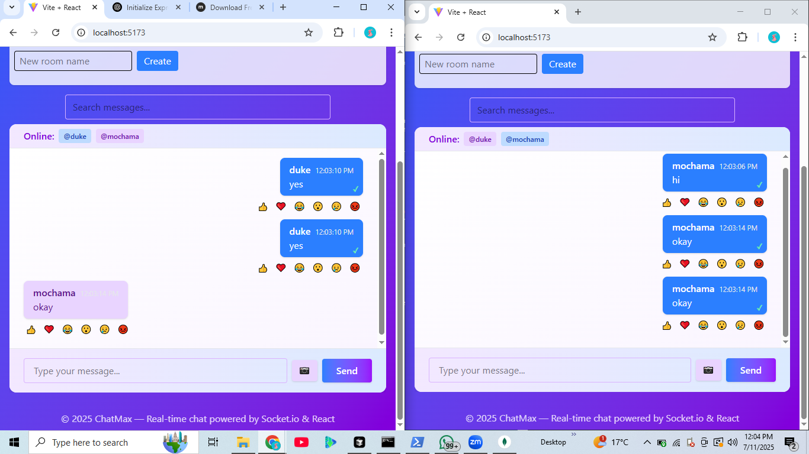
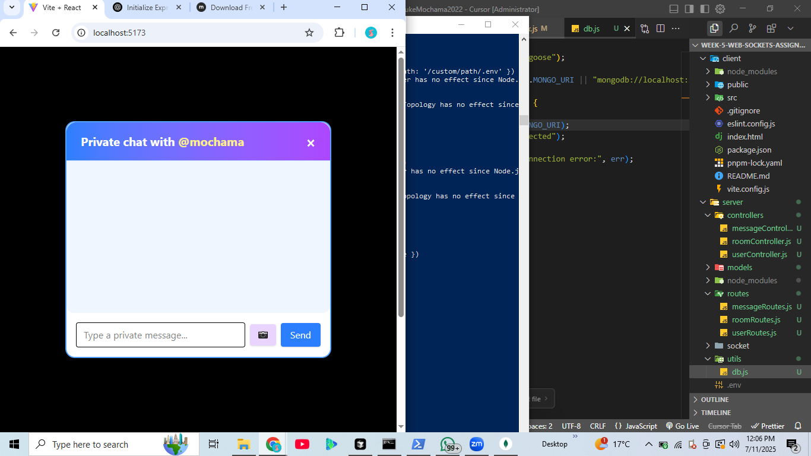
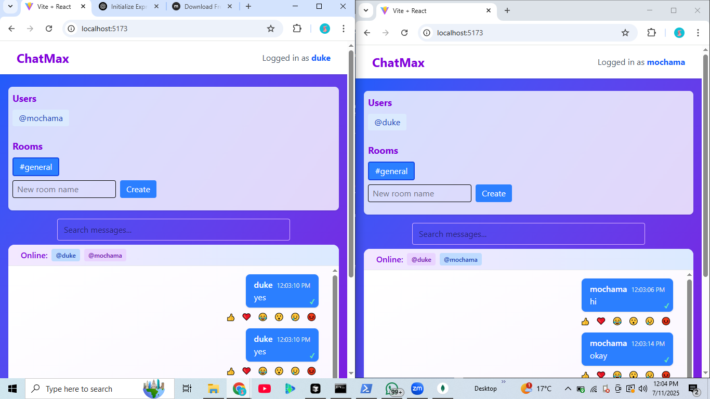

# Real-Time Chat App

A full-featured real-time chat application built with **React**, **Node.js**, **Socket.io**, and **MongoDB**. Supports public rooms, private messaging, image sharing, reactions, read receipts, message search, and more.

---

## 🚀 Project Overview

This app allows users to:

- Join public chat rooms or create new ones
- Send and receive real-time messages (text & images)
- Start private chats with other users
- See online users and typing indicators
- React to messages with emojis
- Get read receipts for private messages
- See unread message badges for rooms and private chats
- Receive sound and browser notifications
- Enjoy a responsive, modern UI

---

## 🛠️ Setup Instructions

### 1. **Clone the repository**

```bash
git clone <https://github.com/PLP-MERN-Stack-Development/week-5-web-sockets-assignment-DukeMochama2022.git>
cd <week-5-web-sockets-assignment-DukeMochama2022.git>
```

### 2. **Backend Setup**

- Go to the `server` directory:
  ```bash
  cd server
  ```
- Install dependencies:
  ```bash
  npm install
  # or
  pnpm install
  ```
- Create a `.env` file:
  ```env
  MONGO_URI=mongodb://localhost:27017/chatapp
  CLIENT_URL=http://localhost:5173
  ```
- Start the backend server:
  ```bash
  node index.js
  # or
  npm start
  ```

### 3. **Frontend Setup**

- Go to the `client` directory:
  ```bash
  cd ../client
  ```
- Install dependencies:
  ```bash
  npm install
  # or
  pnpm install
  ```
- Start the frontend:
  ```bash
  npm run dev
  ```
- The app will be available at [http://localhost:5173](http://localhost:5173)

---

## ✨ Features Implemented

- Multiple public chat rooms (create/join)
- Private 1:1 messaging
- Image sharing (with size validation)
- Message reactions (emoji)
- Read receipts for private messages
- Unread message badges
- Typing indicators
- Sound and browser notifications
- Message search and highlight
- Message delivery status (sending/delivered/failed)
- Responsive/mobile-friendly UI
- Toast notifications for events
- Reconnection logic and banners
- Pagination for chat history

---

## 📸 Screenshots / GIFs

Below are some screenshots of the application in action:

### Main Chat Room



### Private Messaging



### Mobile/Responsive View



---

## 🧑‍💻 Tech Stack

- **Frontend:** React, Tailwind CSS, react-toastify, Socket.io-client
- **Backend:** Node.js, Express, Socket.io, Mongoose, MongoDB

---

## 📄 License

MIT (or your preferred license)
